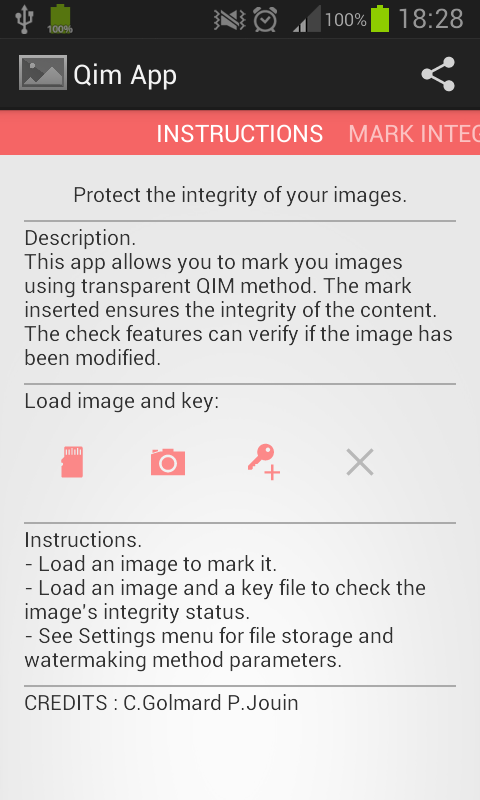
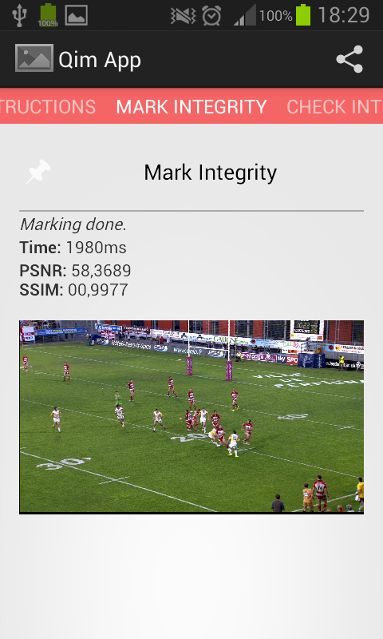

# Qim-Integrity-App

A library and an Android application for content integrity watermarking.

This repository represents my final-year major project in Telecom SudParis 'High Tech Imaging'.

## Folder structure
 
 - `QimWatermarking`: Watermarking library (C/C++) and command-line tool implementing the watermarking (insertion/extraction) algorithms
 - `TestsOnImageFolder`: Applescript for automated tests on images: watermaking transparency and robustness
 - `QimNavigationApp`: Android application project for image watermarking using the native library
 - `Images`: Screenshots
 
## Objectives

The main objective is to implement a technique asserting that the content of an image has not been modified (Integrity), with constraints: 

- Watermarking: insert a message, detect and decide if the content has been modified.
- Transparency: the insertion must be transparent (according to human eyes)
- Robustness: the message must be recoverable if the image has been requantized
- Weakness: the decision must detect modification on the content (objects, shapes, ...) of the image

The watermarking is based on QIM and ST-DM techniques to insert signature in the image based on its content.

## Watermaking library

The Watermarking library (C/C++) uses and requires [OpenCV library](http://opencv.org) for image processing. It provides functions for:

- signature generation based on image content
- image watermaking insertion and detection
- integrity checking comparing detected and computed signatures
- similarity measures (PSNR, SSIM, IF, NCC)

The signature insertion generate a "key file", which is needed for for the detection.

## Android Application

The Android application uses the QimWatermaking native library (through JNI) to enable marking and integrity checking of images.

Features: 

- mark an image loaded from the Image Library
- mark an image taken with the camera
- share the marked image and the key file
- check the integrity given an image loaded from the Image Library and a key file loaded from the device's storage
  - it gives an "integrity score" between 0.0 and 1.0
  - a score over 0.9 assert that the content has not been modifies
  - a score under 0.7 asser that the integrity has been broken
  - intermediate scores depend on image and attacks on content / format.
  
Screenshots
  

  

  

